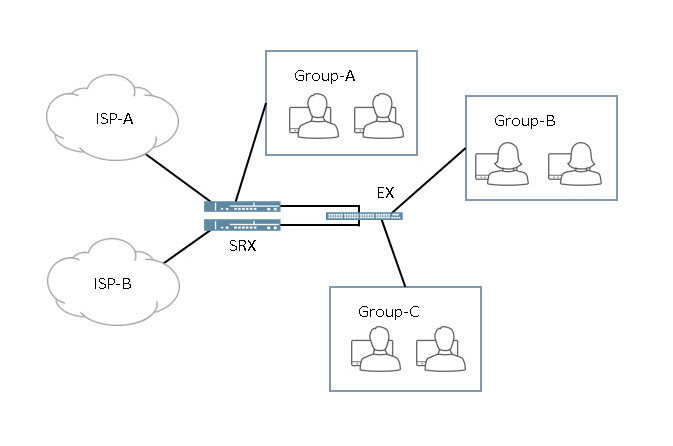
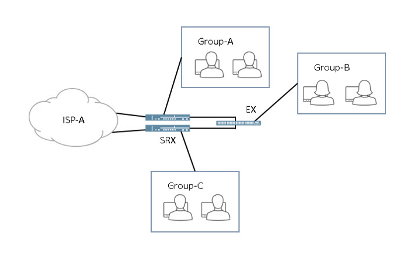
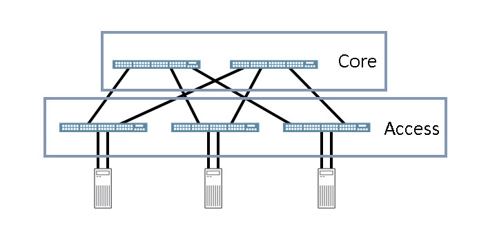

# Design, Associate (JNCDA)
# (JN0-1101)

## Customer Design Requirements

### Customer Business Requirements
+ vision of future growth
++ Feedback : The business summary will likely include a description of the network design project and objectives describing the business and technical goals of the new design. The general overview will likely include planning for future growth and an explanation for why the new design is required**

### Customer Data
+ interviews
+ questionnaires
+ **Feedback : As you begin to work with the customer more closely, you will need to gather the data necessary to accurately determine what you will need for your network design. Use questionnaires, surveys, and interviews to interact with your customer’s workforce.**
+ questionnaires
+ interviews
+ job aids
+ **Feedback : Using questionnaires, interviews, and job aids are great ways to gather data about the customer's current networking environment.**

### Network Design
+ You should understand the state of the customer's current network.
+ You should analyze current and future network behavior.
+ **Feedback : When designing a network for a customer you should always understand the state of the customers current network. You should also analyze the current and future network behavior of the customer's network.**
+ scale constraints of existing hardware
+ protocol incompatibilities
+ **Feedback : The network design must take into consideration the ability of the existing hardware to scale and any protocol incompatibilities between the two networks.**
+ The network engineer can infer traffic patterns.
+ Quality of service (QoS) can be optimized for specific applications.
+ **Feedback : When designing a network, it’s imperative for the network engineer to infer traffic patterns and optimize QoS for specified applications.**

### design boundary
+ Current infrastructure lacks the media to interconnect buildings with each other. **???**
+ **design boundary is caused by the customer's existing physical environment**

### WAN service 
+ MPLS/VPN
+ SONET/SDH
+ **Feedback : MPLS/VPN and SONET/SDH will most likely be used in your network design.**

### Untrusted Domains
+ WAN edge
+ access
+ **Feedback : The WAN edge and access tiers connect to untrusted domains.**

### RBAC
+ network firewall
+ **Feedback : A network firewall provides role-based access to a particular network resource.**

### Juniper lifecycle service
+ Operate
+ Plan
+ Build
+ **Feedback : The three phases of Juniper's lifecycle service approach are plan, build, and operate.**

### the plan methodology
+ Access
+ Design
+ **Feedback : The two sub-phases of the plan methodology are access and design.**
+ "Access" of the plan methodology must you do first

### key RFP elements
+ Business requirements
+ Environmental requirements
+ **Feedback : The business and environmental requirements are key RFP elements.**
+ Modular requirements
+ Connectivity and throughput requirements
+ **Feedback : The modular and the connectivity and throughput requirements are key RFP elements.**
+ A list of design requirements.
+ The types of solutions the design must provide.
+ **Feedback : An RFP must include a list of design requirements and the types of solutions that the design will provide.**

### modular requirements RFP element
+ Hierarchical design considerations
+ Functionality of each module within the design
+ **Feedback : The modular requirements RFP element includes the hierarchical design considerations and the functionality of each module within the design.**

### business requirements RFP element 
+ A summary the type of business the customer is in.
+ An explanation of why a new design is required.
+ **Feedback : The business requirements RFP element includes a summary of the type of business the customer is in and an explanation of why a new design is required.**

### business continuity RFP element
+ Network efficiency requirements
+ QoS requirements
+ **Feedback : The business continuity RFP element includes network efficiency and QoS requirements.**

### environmental requirements RFP element
+ A detailed report that describes the facility specifications.
+ The number of users and workstation requirements.
+ **Feedback : The environmental requirements RFP element includes a detailed report that describes the facility specifications and the number of users and workstation requirements.**

### The connectivity and throughput requirements RFP element
+ Number of wireless connections needed
+ Traffic analysis
+ **Feedback : The modular requirements RFP element includes the number of wireless connections that are needed and a in-depth traffic analysis.**
+ traffic flow analysis
+ **Feedback : The traffic flow analysis will help you determine many variables that will assist you in understanding what is needed when developing the new design.**

### aspects of greenfield projects
+ New networks with few or no restraints to consider.
+ Next-generation networks created from the ground up.
+ **Feedback : Greenfield projects typically involve a new network in which legacy and existing applications do not need to be considered.**

### categories that customer requirements
+ Security
+ Availability
+ **Feedback : The six categories are security, availability, scalability, manageability, and performance**
+ Performance
+ Scalability
+ Manageability
+ **Feedback : The six categories are security, availability, scalability, manageability, and performance.**

### design proposals
+ You should keep your design proposal as simple as possible.
+ You should create the logical design before the physical design.
+ **Feedback : You should keep your design proposal as simple as possible. You should create the logical design before creating the physical design.**
+ Security should be considered throughout the design process.
+ You design proposal should be clearly documented.
+ **Feedback : Security should be considered at every step of the design proposal.**

### modularity in your network design
+ Modularity facilitates future growth and troubleshooting efforts.
+ Modularity provides hierarchical structure to your design.
+ **Feedback : Modularity is important because it helps with future growth and troubleshooting efforts as well as giving a hierarchical structure to your design.**

### brownfield projects
+ Old equipment that should be replaced.
+ Legacy applications that are no longer used.
+ **Feedback : Brownfield projects typically involve an existing network in which legacy and existing application must be considered.**

## Customer Organizational Structure

### business continuity
+ The prevention of interruption to mission-critical services.
+ The ability to reestablish full functionality quickly after a disaster.
+ **Feedback : Business continuity should involve prevention and recovery methods that are proactive. Reactive measures such as manually turning on a backup server, or manually loading backed up data are reactive disaster recovery methods.**
+ Create continuity plans.
+ Analyze packet flow.
+ **Feedback : Business continuity should be proactively built into the network design to ensure that essential functions can continue. Before a business continuity plan can be tested, staff must be notified and also be familiar with what is expected of them for a given scenario. The actual tests can be theoretical or, better yet, they can be full-fledged live exercises.**
+ business continuity
+ **Feedback : Business continuity is an organization’s need to ensure that essential functions can continue during and after a disaster, including the prevention of interruption to mission-critical services, and the ability to reestablish full functionality as quickly as possible.**

### business continuity planning
+ test the plan
+ formulate the plan
+ **Feedback : The steps of business continuity planning are, know your network, assess the risks, formulate the plan, and test the plan.**

### Test the Plan step
+ You should test the plan hypothetically on paper.
+ You should test the plan in full-fledged live exercises.
+ **Feedback : You should always test your plan on paper or in live exercises.**

### user's business model
+ It suggests certain budgetary and scheduling constraints.
+ It allows the engineer to infer certain technical requirements.
+ **Feedback : A user's business model will suggest budgetary and scheduling constraints, as well as provide insight into the network’s technical requirements.**

### Documentation Project
+ Survey all data centers and wiring closets.
+ Review the available documentation with the security administrators.
+ Review the available documentation with the network administrators.
+ **Feedback : As part of your documentation project, you should inspect all data centers and wiring closets, as well as speak to those responsible for them: the security and network administrators.**

### Know Your Network step
+ You should list all the functions and services in the network.
+ You should perform a business impact analysis.
+ **Feedback : In the Know Your Network step of the business continuity planning you should list all the functions and services of the network and perform a business impact analysis.**
+ know your network
+ assess the risks
+ **Feedback : The steps of business continuity planning are, know your network, assess the risks, formulate the plan, and test the plan.**

### Assess the Risks step
+ You should perform a risk assessment.
+ **Feedback : In the Assess the Risks step of business continuity planning you should perform a risk assessment.**

### Formulate the Plan step
+ You should develop a plan of action to mitigate the risks.
+ **Feedback : In the Formulate the Plan step of business continuity planning you should develop a plan of action to mitigate the risks.**

### RFP response
+ Executive summary
+ A solution overview
+ technical specifications
+ **Feedback : An RFP response should include an executive summary, a solution overview, and technical specifications.**

### executive summary section
+ Introduction of the customer's need or problem.
+ **Feedback : The steps of the Juniper recommended executive summary structure in an RFP are: Introduction of the customer's need or problem, identification of business benefits, overview of your proposed solution, and relevant supporting information outlining why the customer should choose your plan.**
+ It is likely to be read by all decision makers.
+ It is an overview of Juniper's value proposition to the customer.
+ **Feedback : The executive summary section of an RFP is so important because it is likely to be read by all decision makers and it contains an overview of Juniper's value proposition to the customer.**
+ Identification of business benefits.
+ **Feedback : The steps of the Juniper recommended executive summary structure in an RFP are: Introduction of the customer's need or problem, identification of business benefits, overview of your proposed solution, and relevant supporting information outlining why the customer should choose your plan.**
+ Focus on organizational issues.
+ Keep it short and simple.
+ **Feedback : When writing an excutive summary of an RFP, you should give focus on the organizational issues of the customer and keep it short and simple. You should avoid a history of Juniper Networks and canned responses.**
+ Overview of your proposed solution.
+ **Feedback : The steps of the Juniper recommended executive summary structure in an RFP are: Introduction of the customer's need or problem, identification of business benefits, overview of your proposed solution, and relevant supporting information outlining why the customer should choose your plan.**
+ Relevant supporting information outlining why the customer should choose your plan.
+ **Feedback : The steps of the Juniper recommended executive summary structure in an RFP are: Introduction of the customer's need or problem, identification of business benefits, overview of your proposed solution, and relevant supporting information outlining why the customer should choose your plan.**

### technical specifications section
+ It should contain the logical and physical topology design requirements.
+ It should contain the bill of materials.
+ **Feedback : The technical specifications section of an RFP should contain the logical and physical topology design requirements. It should also contain the bill of materials.**

### solution overview section
+ It should outline the technical benefits of the proposed design.
+ It should address the customer's goals, scope, and requirements.
+ **Feedback : The solution overview section of an RFP should outline the technical benefits of the design and address the customer's goals, scope, and requirements.**

### network design checklist
+ A process for understanding the customer's business and technical goals.
+ **Feedback : The first four steps of the recommended network design checklist are: A process for understanding the customer's business and technical goals, a validation process for analyzing customer's existing environment, the steps for designing a network topology, and a process for selecting protocols, address schemes, naming conventions, and so forth.**
+ The steps for designing a network topology.
+ **Feedback : The first four steps of the recommended network design checklist are: A process for understanding the customer's business and technical goals, a validation process for analyzing customer's existing environment, the steps for designing a network topology, and a process for selecting protocols, address schemes, naming conventions, and so forth.**
+ A process for selecting protocols, address schemes, naming conventions, and so forth.
+ **Feedback : The first four steps of the recommended network design checklist are: A process for understanding the customer's business and technical goals, a validation process for analyzing customer's existing environment, the steps for designing a network topology, and a process for selecting protocols, address schemes, naming conventions, and so forth.**
+ A validation process for analyzing customer's existing evironment. **???**
+ **??**

### solicit multiple vendors for design
+ Publish an RFI to key vendors.
+ Attend industry conferences.
+ **Feedback : In this scenario, you should publish an RFI to key vendors and attend industry conferences.**

## Physical Design Considerations

### Core Tier
+ performance
+ reliability
+ **Feedback : Performance and reliability are two primary characteristics of the core tier in a network design.**

### High-level design
+ business costs of not going forward
+ impact to the business from an operations perspective
+ cost of the proposed solution
+ **Feedback : Three important areas to define are business costs of not going forward, impact to the business from an operations perspective, and the cost of the proposed solution.**

### route summarization
+ to benefit from a hierarchical IP addressing plan
+ to reduce routing overhead
+ **Feedback : Route summarization provides a hierarchical IP addressing plan and reduces the coexistence of BGP with IGPs.**

### security policy
+ IP address
+ security zone
+ application port
+ **Feedback : Three match criteria of a security policy on an SRX Series device are IP address, security zone, and application port.**

### highly resilient network
+ Virtual Chassis for EX devices.
+ Redundant power supplies for network devices.
+ **Feedback : Virtual chassis for EX devices and redundant power supplies in network devices helps ensure that the network is highly resilient.**
+ Stateful failover for firewall platforms.
+ Chassis clusters for firewall platforms.
+ **Feedback : Stateful failover and chassis clusters for firewall platforms helps ensure that the network is highly resilient.**
+ How-swappable chassis components.
+ Redundant network devices
+ **Feedback : Hot-swappable chassis components and redundant network devices helps ensure that the network is highly resilient.**
+ multiple physical uplinks
+ LAGs towards the LAN.
+ **Feedback : Multiple physical uplinks and LAGs towards the LAN helps ensure that the network is highly resilient. Note that two REs can be placed in the high-end SRX devices, however, the second RE does not act as a backup RE.**
+ EX Series
+ QFX Series
+ **Feedback : A VCF is constructed using a spine-and-leaf architecture. Each spine device must be a QFX5100 device. In an optimal VCF configuration, the leaf devices are also QFX5100 devices. You can, however, also configure QFX3600, QFX3500, and EX4300 switches as leaf devices.**

### backup WAN link
+ When the users in the network rely on communication through VoIP.
+ When the cost of a second link is less than the cost of downtime.
+ **Feedback : You should add a backup WAN link when the users in the network rely on communication through VoIP and when the cost of a second link is less than the cost of the downtime. Note that you cannot combine both WAN link into a LAG to increase throughput because the backup WAN link is with a different provider.**

### physical device redundancy
+ When zero impact to users and applications is required during device failures.
+ When downtime is not acceptable for device upgrades.
+ **Feedback : You should add physical device redundancy to your network design when zero impact to users and applications is required during device failures and when downtime is not acceptable for device upgrades.**

### redundant power supplies are plugged into a single power source
+ The power redundancy requirements are not met as the single source of power could fail and the network devices will not stay powered on.
+ The redundant power supplies should be plugged into separate power sources.
+ **Feedback : Redundant power supplies should always be plugged into separate power sources. If both power supplies are plugged into the same power source, then the failure of the power source will bring down the network device.**
+ when redundant power sources are present on site
+ when a two-device HA solution is not possible
+ **Feedback : You should use redundant power supplies whenever possible. You should make sure that there are redundant power sources on site, plugging redundant power supplies into the same power source doesn't help much if that single power source fails. When a two-device HA solution is not possible due to costs or complexity, redundant power supplies can provide some guarantee against device failure. Note that the SRX320 supports only one power supply.**

### VRRP
+ open standards protocol
+ provides redundancy through a virtual IP address
+ **Feedback : VRRP is an open standards protocol and provides redundancy through the use of a virtual IP address.**
+ The VRRP members can contain two different routing platforms.
+ **Feedback : VRRP do not need any special connections between the members. VRRP is an open standards protocol, which means the routing platforms can be different.**
+ The maximum number of routing devices in a VRRP group is two
+ **Feedback : The maximum number of routing devices in a VRRP group in two.**

+ You should use VRRP on the SRX devices for users in Group-B.
+ You should use VRRP on the SRX devices for users in Group-C.
+ **Feedback : You cannot use VRRP on the WAN connections because each WAN connection belongs to two different providers which means each WAN connection is in a different subnet. You cannot use VRRP on Group-A because Group-A only connects to one SRX device. Users in Group-B and Group-C connect to both SRX devices through the EX device, which allows you to use VRRP with them.**

+ You can use VRRP on the SRX devices to WAN connections.
+ You can use VRRP on the SRX devices for users in Group-B.
+ **Feedback : You can use VRRP on the on the WAN connection, however, this would require some coordination between the customer and the provider. You can also use VRRP with Group-B.**

### single point of failure

+ Connect each server to two access switches.
+ **Feedback : The current topology has a single point of failure for a server if the connected access switch fails. Moving one of the connections on the servers to a different access switch removes this single point of failure.**

### chassis cluster
+ The SRX model numbers must be the same to form a chassis cluster.
+ **Feedback : A chassis cluster must contain the same SRX models. Attempting to cluster an SRX340 and a SRX345 together will not work.**
+ The chassis cluster uses a fabric link between the two nodes.
+ The chassis cluster nodes can be located in different cities.
+ **Feedback : To form a chassis cluster you must use a fabric link between the two nodes and the two nodes can be located in different cities.**
+ The chassis cluster uses a control link between the two nodes.
+ The chassis cluster must contain two identical SRX Series devices.
+ **Feedback : To form a chassis cluster you must use a control link between both nodes and both nodes must be the same SRX Series devices. Note that the interface arrangement should be the same, but the chassis cluster will form if the interface arrangement is different.**

### campus network design
+ distribution of users
+ transmission media characteristics
+ locations of wiring closets
+ **Feedback : Three environmental characteristics that affect the campus network design are distribution of users, transmission media characteristics, and the locations of the wiring closets.**

### campus redundancy best practices
+ You must include highly available redundant connections for all applications in your design.
+ You need to include hardware redundancy in your design.
+ **Feedback : In campus redundancy, you must ensure that there is high availability for all applications and hardware redundancy must be part of your design.**
+ You need to include network redundancy in your design.
+ You need to include redundant wireless access points in your design.
+ **Feedback : In campus redundancy, you must ensure that there is network redundancy and redundant wireless access points in your design.**

### distance between the Ethernet switches
+ 100 meters
+ **Feedback : The maximum distance for a Cat 6 cable is 100 meters.**
+ direct attach copper
+ active optical fiber
+ passive optical fiber
+ **Feedback : Direct attach copper, active optical fiber, and passive optical fiber could be used to interconnect the switches in this scenario.**
+ **to interconnect the switches within the 23 feet (7 meters) distance limitation imposed by the data center**
+ multimode fiber
+ **Feedback : Multimode fiber is ideal for use in this situation.**
+ **cost-effective cable solution to connect a building access switch to a building distribution switch at a distance of 400 feet (120 meters)**

## Logical Design Considerations

### size and scope of a new network design
+ The number of users is important.
+ The type of devices is important.
+ **Feedback : When determining the size and scope of a new network design you should consider the number of users and the type of devices that will be accessing the network.**

### capacity and scaling of systems for a campus switching design
+ The average number of wireless devices that will be connecting to the network.
+ The average bandwidth usage of users.
+ **Feedback : When determining the capacity and scaling of systems in a campus design you should consider the average number of wireless devices that will be connecting to the network and the average bandwidth usage for the users.**

### large campus building with many users who are in different department
+ VLAN
+ **Feedback : The VLAN technology should be used to separate the users within different departments.**

### different groups must be tightly restricted
+ A Layer 4 firewall
+ **Feedback : You should use a firewall to restrict between the different groups.**

### redundant WAN links
+ redundant WAN links
+ **Feedback : Redundant WAN links can address the connectivity issue as a single WAN link could be flapping and causing the connectivity issues.**

### hub-and-spoke VPN
+ **Replace the hub-and-spoke VPN with an ADVPN.
+ **Feedback : Deploying an ADVPN removes the hub device from the forwarding path in spoke-to-spoke communication. Full-meshed VPN does not work in this situation because of the management overhead a full mesh VPN places on the IT staff that has recently seen cutbacks.**
+ hub-and-spoke
+ **Feedback : A hub-and-spoke topology would be one or two campuses or data centers connected to several smaller branch offices. The main site would typically have a higher user density while the branch sites would have a lower user density.**
+ **located in a single, multifloor building. Several smaller, remote buildings connect into your main corporate network**

### Measurement
+ the number of physical desktop ports
+ the number of guest access users
+ the number of unmanned IP enabled end-point systems
+ **Feedback : The measurements needed are the number of physical desktop ports, guest access users, and unmanned IP enabled end-point systems.**
+ ** a goal of providing a differentiated security policy per role and per device**

### SSL VPN
+ **Feedback : SSL VPNs allow remote home workers to access corporate resources securely.**
+ **allows remote home workers to access resources at the corporate headquarters securely**

### Junos Space
+ Network Director
+ **Feedback : The Network Director application can be used to manage VLANs on EX devices.**
+ Security Director: Logging and Reporting
+ **Feedback : You can use the Security Director: Logging and Reporting application to store and management events for SRX devices.**
+ Junos Space typically uses the eth0 interface to manage devices through the OOB network.
+ Junos Space typically uses the eth3 interface to manage devices through the in-band network.
+ **Feedback : Junos Space can use the eth0 and eth3 interface to manage devices. Typically the eth0 interface on a Junos Space device is used to manage devices through the OOB network. Typically the eth3 interface on a Junos Space device is used to manage devices through the in-band network.**
+ Connectivity Services Director
+ **Feedback : The Connectivity Services Director application can be used to manage L3 VPNs on MX devices.**

### Junos Space Security Director
+ centralized
+ **Feedback : The Junos Space Security Director application is a centralized management solution.**

### Network Director
+ centralized
+ **Feedback : Network Director is a centralized management application.**

### disaster recovery
+ Deploying a Data Center Interconnect.
+ **Feedback : Deploying a Data Center Interconnect between two data centers would ensure that the customer is completely prepared for a disaster recovery scenario.**

### Virtual Chassis
+ **Feedback : There is no need for STP with a virtual chassis.**

### virtual chassis fabric (VCF)
+ VCF uses a spine-and-leaf architecture.
+ Each connected host in a data center is no more than two hops away from every other host in a data center.
+ **Feedback : A VCF uses a spine-and-leaf architecture and each connected host is no more than two hops away from any other host.**

+ GRE
+ EVPN
+ **Feedback : You can use GRE and EVPN to stretch L2 traffic between two data centers over the DCI.**

### Datacenter
+ data repositories/distribution
+ data center interconnects
+ high availability considerations
+ **Feedback : Three relevant considerations are data repositories/distribution, data center interconnects, and high availability considerations.**

### Log & Report
+ on-box logging
+ Junos Space Log Director
+ third-party log management
+ **Feedback : On-box logging, Junos Space Log Director, third-party log management would satisfy the requirements.**

## Industry Alternatives
+ VPLS
+ VRRP
+ **Feedback : VPLS and VRRP are open source protocols that can work with multiple different vendors.**

+ RSVP
+ LDP
+ **Feedback : VPLS and VRRP are open source protocols that can work with multiple different vendors.**

+ ISIS
+ LACP
+ **Feedback : ISIS and LACP are open source protocols that can work with multiple different vendors.**

### data-interchange format
+ JSON
+ **Feedback : You can use JSON to automate Junos OS platforms.**

### automate Junos OS platforms
+ PyEZ
+ **Feedback : You can use PyEZ to automate Junos OS platforms.**
+ Chief
+ **Feedback : You can use Chef to automate Junos OS platforms.**

### Junos operational scripts
+ A Junos operational script can be executed manually.
+ A Junos operational script can be executed automatically when a user logs in.
+ **Feedback : A Junos operational script can be executed manually in the CLI and when a user logs in.**

### Junos event policies
+ An event policy uses iQoS requirements

### Junos event scripts
+ Junos event scripts are triggered automatically.
+ Junos event scripts can be used to monitor the overall status of the device.
+ **Feedback : Junos event scripts are triggered automatically and can be used to monitor the overall status of the device.**

### Junos commit scripts
+ Junos commit scripts can enforce custom configuration rules.
+ When a candidate configuration is committed, all active commit scripts are used.
+ **Feedback : Junos commit scripts can enforce custom configuration rules, and all active commit scripts are used when a candidate configuration is committed**