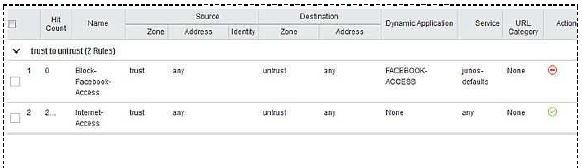

# Security, Associate (JNCIA-SEC)
# (JN0-230)

## SRX Series Devices

### Mini-Physical Interface Modules (Mini-PIMs) on an SRX Series Services Gateway
+ DOCSIS
+ Serial
+ 1-Port Gigabit Ethernet Small Form-Factor Pluggable (SFP)
+ **Feedback : The SRX Series Services Gateways support the following Mini-Physical Interface Modules: 1-Port Small Form-Factor Pluggable (SFP), 1-Port Gigabit Ethernet Small Form-Factor Pluggable (SFP), ADSL2+, DOCSIS, G.SHDSL, Serial, T1/E1, and VDSL2.**
+ **are supported Mini-Physical Interface Modules (Mini-PIMs) on an SRX Series Services Gateways**

### PoE Support
+ SRX320
+ SRX650
+ **Feedback : PoE is supported on the SRX210, SRX240, SRX320, SRX550, and SRX650 devices.**

### default configuration on an SRX300
+ an untrust security zone
+ a DHCP client on ge-0/0/0
+ **Feedback : A default configuration includes two security zones (trust and untrust) as well as setting a DHCP client for interfaces ge-0/0/0 and ge0/0/7.**

### match criteria (to determine if a flow already exists for a packet)
+ source port
+ unique session token number for a given zone and virtual router
+ protocol
+ **Feedback : To determine if a flow exists for a packet, the NPU attempts to match the packet’s information to that of an existing session based on the following match criteria: source address, destination address, source port, destination port, protocol, and unique session token number for a given zone and virtual router**

### match criteria (options are available to be performed on the traffic)
+ permit
+ reject
+ deny
+ **Feedback : A set of actions to be performed in case of a match—permit, deny, or reject.**
+ **When traffic has met match criteria, what options are available to be performed on the traffic**

### Hypervisor Support
+ Hyper-V
+ KVM
+ **Feedback : VMware ESXi is also a supported hypervisor.**
+ **vSRX is available for**

## Junos Security Objects

### Services
+ screens
+ **Feedback : Regardless if the packet is matched or not, the next service to inspect the packet are screens.**
+ zones
+ policy
+ **Feedback : Screens and services ALGs are applied to both fast-path and first-packet processing.**
+ **services does fast-path processing skip**

### Addressing
+ 192.168.0.7/255.255.0.255
+ **Feedback : The wildcard mask determines which of the bits in the IP address A.B.C.D should be ignored. For example, the source IP address 192.168.0.11/255.255.0.255 in a security policy implies that the security policy match criteria can discard the third octet in the IP address (conventionally represented as 192.168.*.11).**
+ **wildcard address for an address book entry**

### Zone
+ zone
+ **Feedback : A zone is a collection of one or more network segments sharing identical security requirements. To group network segments within a zone, you must assign logical interfaces from the device to a zone.**
+ **security component is a collection of one of more network segments sharing identical security requirements**

## Security Policies

### Policy
+ policy
+ **Feedback : Security policies enforce a set of rules for transit traffic, identifying which traffic can pass through the firewall and the actions taken on the traffic as it passes through the firewall. Security policies allow you to decide which users and data can enter and exit the network, as well as where, when, and how**
+ **a set of rules that tells a Junos security device how to treat transit traffic**
+ zone policies, global policies, default policy
+ **Feedback : The Junos OS evaluates traffic against security policies in a specific order. Once a rule that matches traffic has been found, the specified action is taken and policy evaluation ends. Policies are checked in the following order: zone policies, global policies, and the default policy.**
+ **order do Junos security devices examine policies for transit traffic**

### Policy Rule Ordering
+ Rules with more specific match criteria should be listed higher.
+ By default, new rules go to the end of the list.
+ **Feedback : Ordering is important. Rules with more specific match criteria should be listed higher in the order with all new rules (by default) go to the end of the list.**
+ **considering security policy rule ordering**

### security policy components
+ user-defined address object
+ application
+ **Feedback : Each security policy must contain a matching source address, destination address, and application.**

### unified security policies
+ A unified policy can be a global-based policy.
+ A unified policy can be a zone-based policy.
+ **Feedback : You can use both zone security policies and global security policies at the same time within a configuration. However, zone security policies are checked first before global policies.**

## Sky Advanced Threat Prevention

### GeoIP feature of Sky ATP
+ GeoIP uses dynamic address entries.
+ The SRX Series device needs connectivity with the Sky ATP cloud for GeoIP to function properly.
+ **Feedback : The GeoIP feature uses dyanamic address entries and the SRX needs connectivity to the Sky ATP cloud for GeoIP to function properly.**

### C&C threat prevention feature of Sky ATP
+ C&C threat prevention stops compromised hosts in your network from communicating with known C&C servers.
+ C&C threat prevention can stop hosts in your network from unwillingly participating in a DDoS attack.
+ **Feedback : C&C treat prevention stops your hosts from communicating with known C&C servers and stops hosts in your network from unwillingly participating in DDoS attacks.**

### E-mail protection of Sky ATP 
+ Sky ATP e-mail protection inspects SMTP traffic.
+ Sky ATP e-mail protection inspects IMAP traffic.
+ **Feedback : Sky ATP e-mail protection includes the SMTP and IMAP protocols.**

### HTTP file inspection
+ HTTP file inspection
+ **Feedback : Files downloaded from a webserver use HTTP and Sky ATP HTTP file inspection should be used to protect against malicious file transfer in this situation.**
+ **to protect against malicious files that might be download through Web-based e-mail**

## Network Address Translation

### Interface-based NAT
+ Interface-based NAT uses the outbound interface IP address to translate the source address of outgoing packets.
+ **Feedback : All packets subject to translation have their source IP address translated to the IP address on the egress interface. PAT is required to tell sessions from different hosts apart and is always enabled.**

### NAT & PAT
+ both first path and fast path processing
+ **Feedback : A Junos security device implements NAT and PAT in both first path and fast path processing. Note that destination NAT and source NAT occur separately in the first path packet flow.**
+ **When does a Junos security device implement NAT**

### Type of NAT
+ static
+ **Feedback : Three basic types of NAT exist: source NAT, destination NAT, and static NAT. Source NAT translates the source IP address of a packet. Destination NAT translates the destination IP address of a packet. Static NAT allows connections to be originated from either side of the network, but is limited in that only one-to-one translations are possible.**
+ **Bidirectional initiation of translation is classified as which type of NAT**

### Types of source NAT
+ interface-based
+ pool-based
+ **Feedback : Interface-based source NAT: All packets subject to translation have their source IP address translated to the IP address on the egress interface. PAT is required to tell sessions from different hosts apart and is always enabled. Pool-based NAT: A dynamic mapping of the original source address to an address from a user-defined pool. This can be used with or without PAT.**

## IPsec

### Secure VPNs
+ integrity
+ source authentication
+ confidentiality
+ **Feedback : Three major security concerns exist for network security are integrity, source authentication, and confidentiality.**

### IPsec VPN tunnel
+ the VPN Wizard
+ **Feedback : This wizard leads you through the basic required steps to configure basic settings for a router-based VPN. To configure a VPN with a complete set of options, use either the J-Web interface or the command-line interface (CLI).**
+ **In the J-Web user interface, which feature is used to facilitate building IPsec VPN tunnels**

### IDs
+ proxy IDs
+ **You are configuring an SRX Series device to inter-operate with a third-party IPsec VPN endpoint that uses policies to create the VPN. In this scenario, what must be configured for the VPN to work**

### HMAC
+ pre-shared key must be known by both sides
+ adds a pre-shared key (PSK) to the hashing process
+ validates data integrity and verifies that the data came from the proper source
+ **Feedback : One method is to perform source authentication by using a Hashed Message Authentication Code (HMAC). The sender appends a secret preshared key to the data, then performs the hash function. For hashes to successfully match, the receiver must append the same key value to the data before performing the hash function. The key itself never transmits along with the data.**
+ **Hashed Message Authentication Code (HMAC) is a source authentication method based on which three procedures**
## Unified Threat Management

### Junos flow module services
+ interface I/O, security policy, TCP proxy, application proxy
+ **Feedback : As traffic travels inbound on an interface of the SRX Series device, security policies process the traffic. If the security policy contains a UTM policy, a TCP proxy is used to process the matching traffic. The TCP proxy is used for both a TCP client and TCP server, to terminate and originate a TCP session. The TCP proxy feeds the data stream to the application proxy.**
+ **the correct order for processing UTM traffic within the Junos flow module services**

### application control policies
+ Deploy a vSRX with the AppSecure suite in AWS and configure the AppFW.
+ **Feedback : Application Firewall (AppFW) refers to the ability to take the results from the App ID engine and leverage them to make an informed decision to permit, deny/ reject, or redirect the traffic.**
+ **A security administrator wants to deploy application control policies to allow or deny traffic based on dynamic applications in the organization's Amazon Web Services (AWS) deployment**

### antivirus feature on SRX Series
+ The Sophos antivirus feature is less CPU intensive than the full file-based antivirus feature.
+ **Feedback : The Sophos antivirus scanner uses a local internal cache to maintain query responses from the external list server to improve lookup performance. The Sophos antivirus scanning is offered as a less CPU-intensive alternative to the full file-based antivirus feature.**

### UTM
+ antispam
+ antivirus
+ content filtering
+ **Feedback : Unified threat management (UTM) provides multiple security features and services in a single device or service on the network, protecting users from security threats in a simplified way. UTM includes functions such as antivirus, antispam, content filtering, and Web filtering.**
+ **Unified Threat Management (UTM) include**
## Monitoring/Reporting

### Log Collector
+ Log Receiver node
+ Log Storage node
+ **Feedback : For larger deployments, begin with a single Log Receiver node and Log Storage node, and incrementally add Log Storage nodes as your needs expand.**
+ **You are installing a Junos Space Log Collector VM for a large-scale deployment. What are two valid node types for this deployment**

### Packages
+ It supports strong encryption.
+ It is a standard release.
+ **Feedback : The edition will typically be either domestic or export. Domestic versions support strong encryption, whereas export versions do not. S is for service releases.**
+ **the package “junos-srxme-19.1R1.6-domestic.tgz”. Based on the naming convention...**

### routine engine
+ security logging
+ **Feedback : Security logging must be enabled before the reporting engine can create reports.**
+ **Prior to creating reports by the routing engines, what must be enabled on an SRX Series device**

### troubleshooting
+ Ping Host
+ Traceroute
+ **Feedback : Both utilities are available under the Administration -> Tools -> workspace.**
+ **troubleshooting utilities are available within the J-Web interface**

## Other

### Junos control plane
+ implemented on the RE
+ responsible for kernel processes
+ **two distinctions of a Junos control plane**
+ **OK**

### Junos data plane (Wrong)
+ screen options
+ clustering control (X)
+ implemented on the PFE (X)
+ implemented on RE
+ **two distinctions of a Junos data plane**
+ (**Wrong : Cluster+PFE**)
+ (**To try: Screen+PFE**)

### Exception traffic (Wrong)
+ ICMP
+ OSPF updates (X)
+ packets with IP options
+ encrypted packets (X)
+ (**Wrong : OSPF + Encrypt)

### J-Web
+ configuration commits are required
+ real-time monitoring
+ **OK**

### Requirements of a functional zone (Wrong)
+ It must be named fxp0.
+ It must be named management.(X)
+ It cannot pass transit traffic.
+ It can pass transit traffic. (X)

### Junos security device (Wrong)
+ By default, a Junos security device allows SSH only.(Wrong)
+ By default, a Junos security device allows Telnet only.
+ By default, a Junos security device allows both Telnet and SSH.
+ By default, a Junos security device does not allow traffic destined to itself.

### System defined zone
+ junos-host
+ **OK**

### security component would help identify application type of all allowed traffic traversing port 80
+ application firewall
+ **OK**

### Security policy components require
+ a user-defined name
+ match criteria
+ action
+ **OK**

### the default policy’s action for any traffic not matching a configured zone security policy or global policy
+ silent discard
+ **OK**

### Sky ATP file inspection profiles (Wrong)
+ They are used to determine which action to take for malicious files found in HTTP traffic. (X)
+ They are used to determine which action to take for malicious files found in SMTP traffic.
+ They are used to determine the maximum size of files to scan.
+ They are used to determine which file types to scan. (X)

### the free version of Sky ATP, file type you can scan
+ EXE files
+ **OK**

### the next step after creating a threat prevention policy
+ Reference the threat prevention policy in a security policy.
+ **OK**

### the default action of an advanced anti-malware policy applied to a file (Wrong)
+ When the verdict number of the file is less than the verdict threshold.
+ When the verdict number of the file is more than the verdict threshold.
+ When Sky ATP is unable to scan the file. (Wrong)
+ When the traffic doesn’t match a threat prevention policy.

### a Junos OS security device do to existing sessions upon commit, when a change is made to a NAT rule pool that is currently in use
+ It destroys the existing session and creates a new session for matched traffic.
+ **OK**

### You have enabled a NAT pool on an SRX Series device; however, you are not receiving any return traffic. What configuration item will solve this? (Wrong)
+ enabling MACsec (Wrong)
+ enabling proxy ARP
+ expand the NAT pool
+ disabling PAT

### In the first layer of a two-layer matching condition for a NAT rule, what are three matching options for the traffic direction matching from a “from” clause (Wrong)
+ interface (X)
+ zone
+ MAC address (X)
+ TCP/IP port (X)
+ routing instance

### operational command allows users to observe NAT translations (Wrong)
+ show security flow status
+ show security flow gate (To try)
+ show security flow statistics (Wrong)
+ show security flow session

### hashing functions provide data integrity in VPNs
+ original data cannot be determined from the hash value
+ stronger hashes minimize collisions in hash comparisons
+ **OK**

### In the IKE Phase 1 configuration, what are the two choices for “Mode”
+ main
+ aggressive
+ **OK**

### traffic selectors distinguish interesting transit traffic over a VPN tunnel (Wrong)
+ by specifying accepted applications
+ by specifying accepted TCP/IP ports
+ by specifying accepted networks
+ by specifying accepted MAC address (Wrong)

### When setting up a VPN to a remote gateway, what would selecting the “Optimized” check box do when selecting “Enable VPN monitor”
+ consider transit traffic as the tunnel verification
+ **OK**

### When does a Junos security device perform UTM inspection?
+ both first path and fast path processing
+ **OK**

### Which list order does the antispam filter process e-mail for spam? (Wrong)
+ external spam block list server, whitelist, blacklist
+ blacklist, whitelist, external spam block list server(Wrong)
+ whitelist, blacklist, external spam block list server
+ external spam block list server, blacklist, whitelist

### What two whitelist types are supported for the SRX antivirus module? (Choose two.) (Wrong)
+ Application
+ URL
+ MIME
+ File
+ (**Wrong, URL+File)
+ **(To try, URL+MIME)

### Which two methods are used to notify a user they’ve had content blocked an SRX Series device? (Choose two.) (Wrong)
+ embedded message in the protocol (**To try**)
+ webhook (X)
+ SNMP trap (X)
+ an e-mail message can be sent (**To try**)

### Using the J-Web interface on an SRX Series device, what information is available when displaying the Monitor -> Routing -> Route Information? (Wrong)
+ inactive routes
+ inet4.0 route table (Wrong)
+ next hop latency
+ next-hop type

### Using J-Web on an SRX Series device, what are two required fields for the initial setup? (Choose two.)
+ Host Name
+ Root Password
+ **OK**

### Which three Juniper devices are supported by Juniper Sky Enterprise? (Choose three.) (Wrong)
+ SRX Series
+ EX Series
+ MX Series
+ NFX Series
+ QFX Series
+ **(Wrong, S-M-Q)**
+ **(To try, E-Q-S)**

### Which three reports does Juniper Sky Enterprise offer in real-time on Junos EX Series devices? (Choose three.) (Wrong)
+ failed Junos device login attempts (X)
+ PoE monitoring
+ live packet capture
+ ARP tables (X)
+ VPN tunnel throughput (X)

### Which two hypervisors support vSRX Series devices? (Choose two.)
+ VMware ESX
+ KVM
+ **OK**

### Users are restricted from accessing Facebook, however, a recent examination of the security logs show that users are accessing Facebook. Referring to the exhibit, what should you do to solve the problem? (Wrong)

+ Change the Block-Facebook-Access rule service to "any".
+ Change the Internet-Access rule dynamic application to "any".
+ Change the Block-Facebook-Access rule dynamic application to "any". (Wrong)
+ Change the Internet-Access rule service to "junos-defaults".